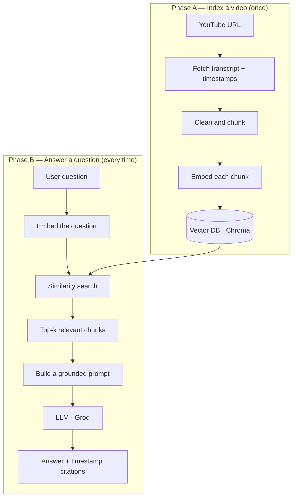

# How It Works — Tube AI RAG

A plain-English walkthrough of the architecture: how a YouTube link becomes a set
of answerable, **cited** insights. New to RAG? Read top to bottom. Reviewing the
code? This is your map.

---

## What is RAG?

**Retrieval-Augmented Generation (RAG)** is a pattern for making a language model
answer questions about *specific* data it was never trained on. Instead of relying
on what the model already "knows," we:

1. **Retrieve** the most relevant pieces of our own data (here, parts of a video transcript), then
2. **Augment** the model's prompt with those pieces, so it **generates** an answer grounded in real evidence.

The model supplies fluent language; our data supplies the facts.

## Why not just send the whole transcript to the model?

- **Context limits** — a long video transcript can exceed how much text a model accepts at once.
- **Cost & speed** — resending the entire transcript on every question is expensive and slow.
- **Accuracy** — models get "lost in the middle" of long text and miss the relevant part.
- **Hallucination** — with no grounding, a model can invent plausible but wrong answers.

RAG sends only the handful of most-relevant passages per question — making answers
cheaper, faster, more accurate, and traceable back to a source (a timestamp, in our case).

## Architecture at a glance

There are two phases: **indexing** a video (happens once) and **answering** a
question (happens every time you ask).

Phase A does the heavy lifting once. Phase B is fast because the transcript is
already embedded and indexed.

---

## The pipeline, step by step

### 1. Transcript extraction
`youtube-transcript-api` pulls the caption track, and each line arrives with a
**timestamp**. Those timestamps let the app cite exactly where an answer came from
("see 04:12"). A fallback path handles videos with no captions or requests that
YouTube blocks.

### 2. Chunking
The transcript is split into bite-sized pieces (a few hundred words each) with a
small **overlap** between neighbors, so an idea spanning a boundary isn't cut in
half. Each chunk keeps its start timestamp. Chunk size is a tuning knob: too large
makes retrieval noisy and costly; too small strips away context.

### 3. Embeddings
An embedding model turns each chunk into a **vector** — a list of numbers (384 of
them, in our model) that captures the text's *meaning*. Texts with similar meaning
land close together in this number-space, so "how do I install it?" sits near
"setup instructions" even with no shared words. This project uses
`sentence-transformers` (`all-MiniLM-L6-v2`) **locally**: free, no API key, no rate
limits, CPU-friendly.

### 4. Vector database
The vector DB stores every chunk-vector and, given a query vector, finds the
closest ones quickly (via cosine similarity / approximate-nearest-neighbor search).
That "find the closest vectors" step *is* the retrieval in RAG. This project uses
**Chroma**, which persists to disk so the index survives restarts.

### 5. Retrieval
When a question comes in, it's embedded with the same model, and the DB returns the
**top-k** nearest chunks (k ≈ 4–6). Those chunks are the evidence for that specific
question.

### 6. Prompt construction & generation
The app assembles a prompt with three parts: a **system instruction** ("answer only
from the context below; if it isn't there, say you don't know"), the **retrieved
chunks** (with timestamps), and the **question**. This goes to the LLM (Llama on
**Groq** — free and fast). Grounding the model in supplied text is what suppresses
hallucination and enables citations.

### 7. API layer
**FastAPI** exposes the system over HTTP: `/ingest` (index a video), `/ask` (answer
a question), and later `/quiz` and `/summary`. It's **async** for speed, uses
**Pydantic** to validate every request and response, and auto-generates interactive
docs at `/docs`. This is the backend product other apps (or a browser) can call.

### 8. Evaluation
Once it works, quality is *measured* with **RAGAS**:
- **Faithfulness** — did the answer stick to the retrieved sources?
- **Answer relevance** — did it actually address the question?
- **Context precision** — did retrieval fetch the right chunks?

Measuring retrieval quality is what separates an engineered system from a demo.

### 9. Deployment
**Docker** packages the app to run identically anywhere, and a free host (Hugging
Face Spaces or Render) serves it at a public URL — so the project is "click this
link and try it," not "read this code and trust me."

---

## Key terms

| Term | Meaning |
|---|---|
| **Embedding** | A numeric vector representing the *meaning* of a piece of text. |
| **Vector space** | The multi-dimensional space where similar meanings sit close together. |
| **Chunk** | A small slice of the transcript that gets embedded and retrieved as a unit. |
| **Cosine similarity** | A measure of how close two vectors are — the basis of semantic search. |
| **Top-k** | The k most similar chunks returned for a query (here, ~4–6). |
| **Grounding** | Forcing the model to answer only from provided context. |
| **Hallucination** | A confident but unsupported/incorrect model answer — what grounding prevents. |
| **RAG** | Retrieve relevant data, then let the model generate an answer from it. |

## The system in one paragraph

> A RAG system over YouTube transcripts: fetch and chunk the transcript, embed the
> chunks with a sentence-transformer, and store them in a vector database. For each
> question, embed it, retrieve the most similar chunks, and have an LLM answer
> strictly from those chunks — with citations back to the video's timestamps. It's
> served as a FastAPI application, with retrieval quality measured using RAGAS.

For setup and run instructions, see the [README](../README.md).
